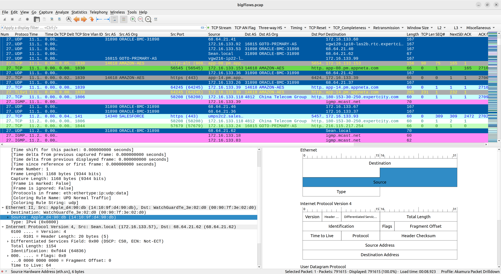

# Wireshark Packet Drilldown Profile


I spent many years around Wireshark and finally I decided to publish for every Network Warrior a profile that aims to help making troubleshooting a little easier.

[](https://developer.cisco.com/codeexchange/github/repo/akamura/wireshark-profile)

The profile have some useful filters, packet list column addons as well as color categorisation including:
1. Network Vlan ID's
2. Autonomous System number and organisation this helps you understand where the traffic is coming from/to public networks
3. Three-way Handshake filters
4. TCP retransmission analyse filters
5. L2 and L3 network filters
6. Miscellaneous filters to help you speed out investigation

### Install

1. You need Wireshark version 4 and above.
2. Download the profile and import it in your Wireshark environment.

### Usage

To access informations such as AS numbers resolution you need to download updated MaxMind Database.
You can sign up for free at MaxMind and tell Wireshark where to get the mmdb files.

#### Install MaxMind DB GeoIP Autoupdate in UBUNTU
If you run on Ubuntu you can install the useful MaxMind autoupdate tool to keep the DB's at the latest version.

```sh
$ sudo add-apt-repository ppa:maxmind/ppa
$ sudo apt update
$ sudo apt install geoipupdate
```

Then edit the GeoIP.conf file with your account information and include the GeoLite2-ASN database like below.

```sh
$ sudo nano /etc/GeoIP.conf

# Replace YOUR_ACCOUNT_ID_HERE and YOUR_LICENSE_KEY_HERE with an active account
# ID and license key combination associated with your MaxMind account. These
# are available from https://www.maxmind.com/en/my_license_key.
AccountID YOUR_ACCOUNT_ID_HERE
LicenseKey YOUR_LICENSE_KEY_HERE

# Enter the edition IDs of the databases you would like to update.
# Multiple edition IDs are separated by spaces.
EditionIDs GeoLite2-Country GeoLite2-City GeoLite2-ASN
```

Now it's time to get the DB's
```sh
$ sudo geoipupdate
```

Check that you have the files there
```sh
$ ls -lh /usr/share/GeoIP/
total 82M
-rw-r--r-- 1 root root 7,9M giu 17 13:28 GeoLite2-ASN.mmdb
-rw-r--r-- 1 root root  68M giu 17 12:58 GeoLite2-City.mmdb
-rw-r--r-- 1 root root 5,7M giu 17 12:58 GeoLite2-Country.mmdb
```

Now you should have all DB's in mmdb format in /usr/share/GeoIP folder, you should open Wireshark Preferences and update the MaxMind Database Directories Paths under Name Resolution menu.

Happy troubleshooting!
